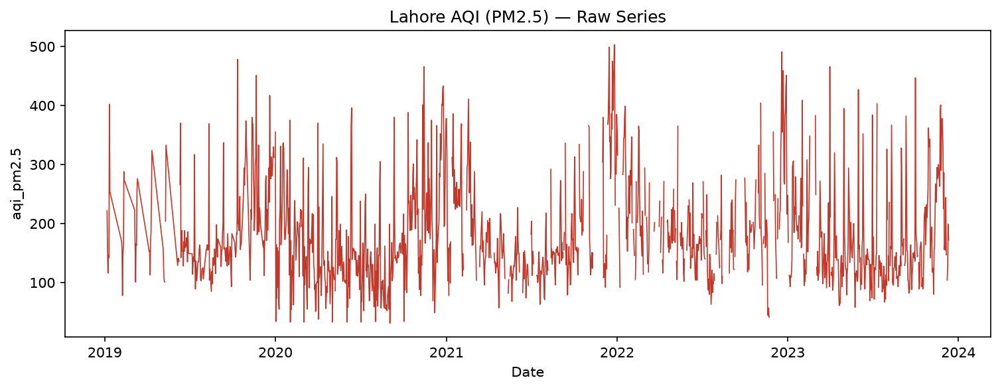
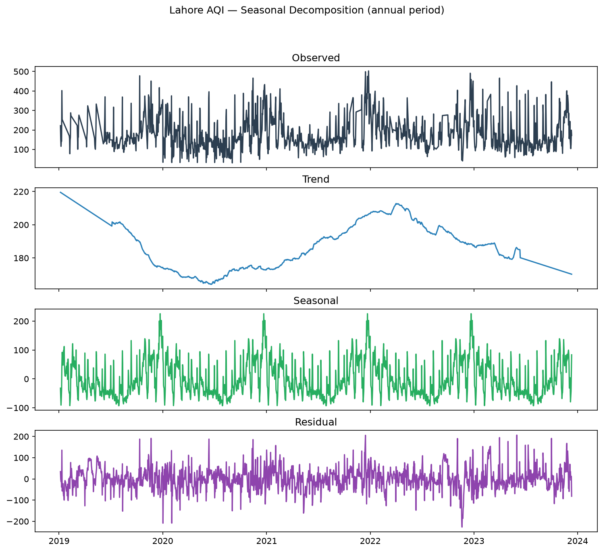
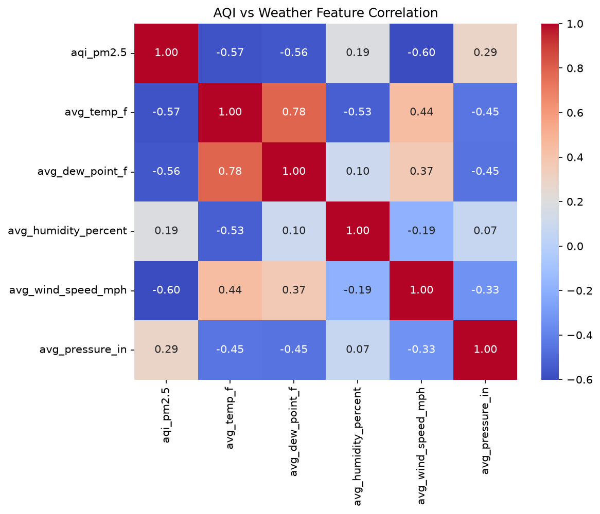
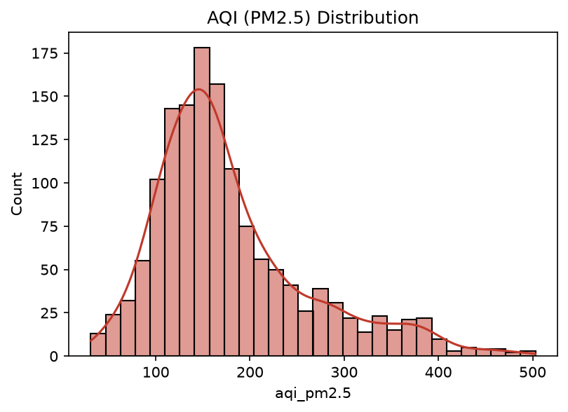
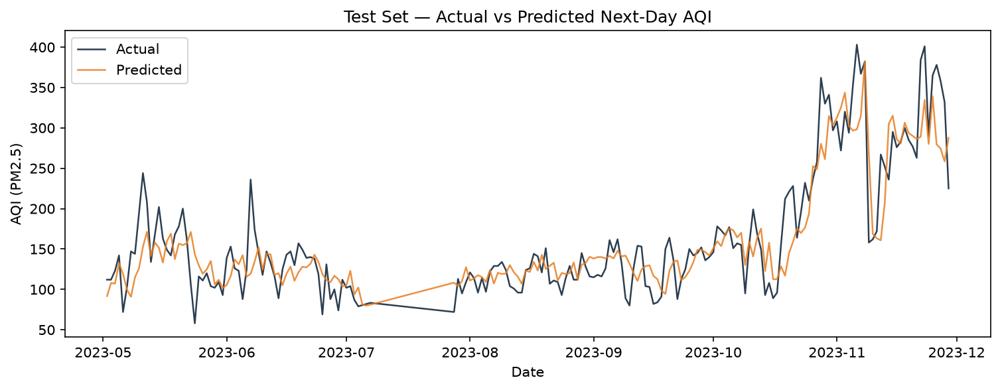
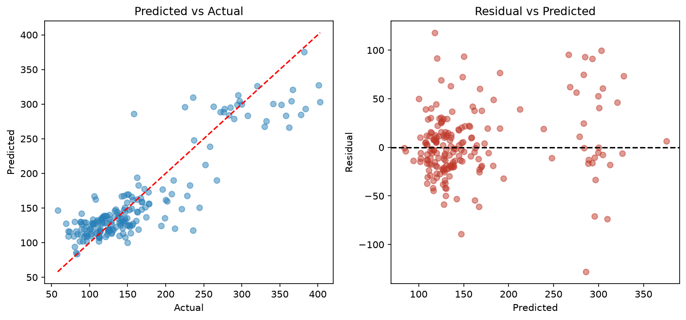
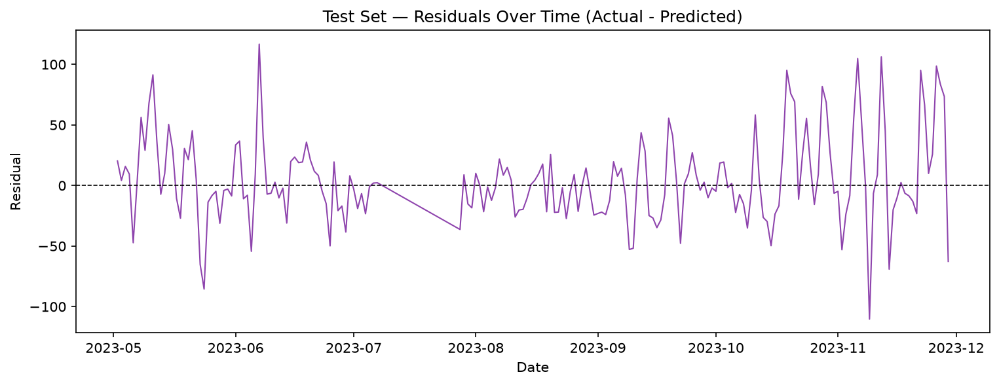
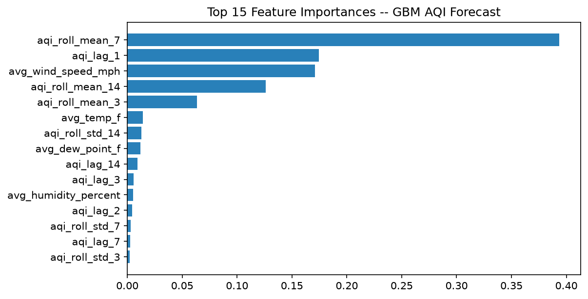

# SmogSense

**Next-day AQI (PM2.5) forecasting for Lahore, Pakistan — an end-to-end time-series ML pipeline built on real, messy, public data.**

This isn't a toy notebook trained on a clean textbook dataset. It's a full pipeline — data audit, gap-bounded preprocessing, a classical ML baseline with a stated rationale, honest evaluation, a served API, and a Model Card that names the model's actual weaknesses instead of hiding them behind one aggregate metric.

---

## Table of Contents

1. [Why This Project Exists](#why-this-project-exists)
2. [What SmogSense Does](#what-smogsense-does)
3. [The Dataset](#the-dataset)
4. [Exploratory Data Analysis](#exploratory-data-analysis)
5. [How the Pipeline Works](#how-the-pipeline-works)
6. [Model Choice — Why Gradient Boosting, Not an LSTM](#model-choice--why-gradient-boosting-not-an-lstm)
7. [Results](#results)
8. [Reading the Diagnostic Plots](#reading-the-diagnostic-plots)
9. [Honest Limitations](#honest-limitations)
10. [Project Structure](#project-structure)
11. [Setup & Usage](#setup--usage)
12. [The API](#the-api)
13. [Key Engineering Decisions](#key-engineering-decisions)
14. [Bugs Found & Fixed Along the Way](#bugs-found--fixed-along-the-way)
15. [Future Work](#future-work)
16. [Tech Stack](#tech-stack)

---

## Why This Project Exists

Pakistan's average PM2.5 in 2025 was measured at 67.3 µg/m³ (AQI ~156, "unhealthy") — nearly 14x the WHO guideline — making it one of the most polluted countries on record. Lahore in particular is repeatedly ranked among the world's worst cities for air quality, with AQI spiking past 300–500 during winter smog season, driven by a combination of crop-residue burning, vehicle and industrial emissions, and a seasonal temperature inversion that traps pollutants near ground level.

During peak smog months, hospitals report enormous surges in respiratory cases — figures in the millions across Punjab in a single month during severe seasons. And the tools available to an ordinary resident are almost entirely **reactive**: current-AQI readings, not forecasts. People find out the air is dangerous by checking today's number or by how they feel — not by getting a warning the day before.

SmogSense asks a narrower, answerable question: **given the last few weeks of AQI and weather readings, can a model forecast tomorrow's AQI well enough to be a useful early warning?** The answer, honestly, is "partially, with specific known weaknesses" — and this project is as much about *characterizing those weaknesses correctly* as it is about the forecast itself.

## What SmogSense Does

- Takes a window of recent daily AQI + weather history as input
- Forecasts next-day AQI (PM2.5) as a continuous value
- Returns a naive uncertainty band around that forecast, grounded in real test-set error (not a made-up confidence number)
- Is served as a FastAPI endpoint, so it's a working service, not just a notebook

## The Dataset

**Source:** [Lahore Air Quality Index](https://www.kaggle.com/datasets/shabbirchinioti/lahore-air-quality-index) (Kaggle) — daily AQI (PM2.5) and weather readings for Lahore.

**Raw columns:**
```
date, aqi_pm2.5, max_temp_f, avg_temp_f, min_temp_f,
max_dew_point_f, avg_dew_point_f, min_dew_point_f,
max_humidity_percent, avg_humidity_percent, min_humidity_percent,
max_wind_speed_mph, avg_wind_speed_mph, min_wind_speed_mph,
max_pressure_in, avg_pressure_in, min_pressure_in
```

**Coverage:** 2019-06-01 to 2023-11-30 — 1,644 raw rows out of 1,801 possible calendar days.

**The data is genuinely incomplete, and that's stated upfront rather than glossed over:**
- **157 calendar days are entirely missing** from the source (~8.7% of the date range has no row at all)
- **221 additional rows have a null `aqi_pm2.5` value** even where the row exists
- Combined, **roughly 21% of the target series required handling** before it could be used for training

This is a real modeling decision point, not a footnote — see [How the Pipeline Works](#how-the-pipeline-works) for exactly how it's handled.

One data-quality bug worth calling out: the raw `date` column is formatted `DD-MM-YY` (e.g. `13-06-19` = June 13, 2019) — not the more common `MM-DD-YY` or ISO format. This was only caught because pandas' strict parser rejected `13` as an invalid month, which is exactly the kind of silent-corruption risk that a **loud, sanity-checked date parser** protects against (the pipeline prints the parsed date range on every load specifically to catch this class of bug immediately).

## Exploratory Data Analysis

### Raw AQI series



The raw series immediately shows what smog season looks like quantitatively: sharp, recurring spikes reaching 400–500 AQI clustered in the same months each year (winter), with calmer baseline readings (~100–150) the rest of the year. This single plot is the visual justification for the entire project — the pattern is real, recurring, and forecastable in principle.

### Seasonal decomposition



Decomposing the series (additive model, annual period) into trend, seasonal, and residual components shows:
- **Trend:** a dip through 2020 — plausibly tied to reduced traffic/industrial activity during COVID-era lockdowns — followed by a climb back up by 2022.
- **Seasonal:** a strong, consistent annual cycle with sharp winter peaks, confirming smog season is a structural pattern, not random noise.
- **Residual:** what's left after removing trend and seasonality — still fairly noisy, meaning day-to-day AQI has real unpredictability beyond the seasonal pattern (part of why this is a genuinely hard forecasting problem, not a trivial one).

### Correlation with weather



AQI correlates most strongly with **wind speed (−0.60)** and **temperature (−0.57)**, both negative. This makes physical sense:
- Higher wind disperses pollutants → lower AQI.
- Winter's low temperatures coincide with the temperature-inversion effect that traps pollutants near the ground → higher AQI.

This is the empirical justification for including weather as model features, not just AQI history alone.

### Target distribution



The AQI distribution is **right-skewed** — most days sit in the 100–200 range, with a long tail out to ~500. This shape has a direct, important consequence for the model (explained in [Reading the Diagnostic Plots](#reading-the-diagnostic-plots)): a model trained to minimize average error will naturally focus on the dense middle of the distribution and underperform on the rare, extreme high-AQI days — which are exactly the days an early-warning system exists for.

## How the Pipeline Works

**1. Load & audit.** Raw CSV is parsed with an explicit date format, sorted chronologically, deduplicated, and immediately audited for missing days and null values — the audit numbers above come directly from this step, not an estimate.

**2. Gap handling (explicit, bounded, honest).** The series is reindexed onto a continuous daily calendar. Gaps of **3 days or fewer** are linearly interpolated. Gaps **longer than 3 days are left as missing** and later dropped — never synthetically filled. This threshold lives in `Config.max_interpolation_gap_days` so it's a visible, adjustable modeling decision, not a buried default.

**3. Feature engineering.** For each day, the model sees only information that would actually be available at prediction time:
- **Lagged AQI:** values from 1, 2, 3, 7, and 14 days ago
- **Rolling AQI statistics:** 3/7/14-day rolling mean and standard deviation, computed on *shifted* history (`.shift(1).rolling(...)`) so there's zero same-day leakage
- **Same-day weather:** temperature, dew point, humidity, wind speed, pressure

The **target** is AQI at day *t+1* — this is a genuine next-day forecast, not same-day nowcasting.

**4. Chronological split — never shuffled.** Train = 2019 to mid-2022, Validation = mid-2022 to mid-2023, Test = the most recent unseen window (2023-05 to 2023-11). Time series data must never be randomly shuffled into train/test, since that would let the model "see the future" during training — a mistake that silently inflates reported performance in a huge fraction of amateur time-series projects.

**5. Train → Evaluate → Serve.** A single shared feature-building function (`build_feature_columns`) is used by both the training pipeline and the live inference path — enforced by an automated test — specifically so the model can never see a different feature vector in production than it was trained on.

## Model Choice — Why Gradient Boosting, Not an LSTM

The original concept for this kind of AQI forecaster reached for an LSTM or Temporal Fusion Transformer. That was deliberately **not** the first thing built here. With only **~1,285 usable training rows** after gap-handling, a deep sequence model doesn't have enough data to reliably outperform — or even match — a well-tuned classical baseline, and would be far more likely to simply overfit or produce unstable results.

So the actual model is a `scikit-learn` **Pipeline**: `StandardScaler` → `GradientBoostingRegressor` (`n_estimators=300`, `learning_rate=0.05`, `max_depth=3`) — 18 input features total (5 lags + 9 rolling stats + 5 weather features... precisely: 5 lags, 3 rolling means, 3 rolling stds, 5 weather = 16 numeric features feeding the model, per `feature_importance` plot below).

This is a **stated trade-off, not a limitation to apologize for**: start simple, prove out the pipeline and the forecasting signal honestly, and let the results tell you whether the added complexity of a deep model is actually justified. As the results below show, it *is* justified for one specific reason — and that reason is now precisely identified rather than assumed.

## Results

Chronological split, real numbers, no cherry-picking:

| Split | RMSE  | MAE   | Rows |
|-------|-------|-------|------|
| Train | 24.67 | 18.67 | ~901 |
| Val   | 50.41 | 35.60 | ~192 |
| Test  | 35.82 | 25.56 | ~192 |

Test error falling **between** train and val is itself informative: it means the val period wasn't just an unlucky outlier stretch — the model's error is consistently in the 25–50 point range whenever evaluated on unseen data, which points toward mild general overfitting rather than one freak event skewing val specifically.

For context: Lahore's AQI regularly runs into the 100s–300s during smog season, so a MAE around 25 is a meaningful, non-trivial forecasting signal — but far from perfect, and the plots below show exactly where it breaks down.

## Reading the Diagnostic Plots

### Actual vs. predicted over time



The predicted line (orange) tracks the actual line (dark) closely through the calmer months (May–September), but visibly **lags and smooths out** the sharp whipsaw swings during smog onset (October–November) — actual AQI jumps from ~160 to ~400 and back within days, while the model's prediction reacts more slowly and with less amplitude.

### Predicted vs. actual scatter + residuals



The left panel shows predictions hugging the diagonal (perfect-prediction line) nicely for actual AQI up to ~250 — but **above that, predictions systematically fall below the diagonal**, meaning the model underestimates the worst air-quality days. The right panel confirms this: residual spread widens noticeably as predicted AQI increases (heteroscedasticity), and error variance is clearly larger in the high-AQI region.

### Residuals over time



Residuals stay mostly within a ±50 band through the stable months, then blow out past ±100 specifically during the October–November 2023 smog transition. This is the clearest evidence that the model's main weakness isn't "randomly wrong everywhere" — it's **specifically weaker during rapid AQI transitions**, which is a precise, actionable finding rather than a vague "needs more tuning."

### Feature importance



`aqi_roll_mean_7` and `aqi_lag_1` dominate by a wide margin, with `avg_wind_speed_mph` as the strongest weather signal — consistent with the correlation heatmap in the EDA section. This confirms the model is heavily **autoregressive**: it leans on "what AQI has been doing recently" far more than on weather conditions, which directly explains why it struggles when AQI *suddenly* deviates from its recent trend — the exact pattern seen in the residuals plot above.

**Put together, these four plots tell one consistent, verifiable story:** the model is a solid trend-follower that structurally struggles with sudden regime changes and extreme values — precisely the two things that matter most for an early-warning tool. That's not spin; it's the honest reading of the evidence, and it's exactly what motivates the Future Work section below.

## Honest Limitations

Full detail in [`MODEL_CARD.md`](MODEL_CARD.md). Summary:

1. **Underestimates extreme tail values** (AQI > ~300) — the exact regime where warnings matter most.
2. **Lags during rapid AQI transitions** — heavy reliance on recent-history features means sudden smog onset is under-reacted to.
3. **Mild overfitting** — train error is meaningfully lower than held-out error at current hyperparameters.
4. **Weather features are same-day observed values, not forecasts** — a real deployment would need next-day weather *forecasts*, which weren't available in this dataset.
5. **Single-city, single-pollutant** — trained only on Lahore PM2.5; not validated elsewhere.
6. **Naive uncertainty band** — forecast ± test RMSE is a rough heuristic, not a statistically calibrated prediction interval.

## Project Structure

```
smogsense/
├── data/
│   ├── raw/                      # lahore_aqi.csv goes here
│   └── processed/                # train/val/test CSVs (generated, gitignored)
├── notebooks/
│   └── eda.py                    # produces the 4 EDA figures above
├── src/
│   ├── config.py                 # every path, column name, hyperparameter — one place
│   ├── data/
│   │   ├── load_data.py          # parsing, dedup, missing-data audit
│   │   └── preprocess.py         # gap handling, feature engineering, chronological split
│   ├── models/
│   │   └── model.py              # sklearn Pipeline definition
│   ├── train.py                  # fit, log metrics, feature-importance plot
│   ├── evaluate.py               # test-set metrics + 3 diagnostic plots
│   ├── predict.py                # single-call next-day forecast + uncertainty band
│   ├── utils/
│   │   └── seed.py               # reproducibility
│   └── app/
│       └── main.py               # FastAPI /predict, /health
├── tests/
│   └── test_pipeline.py          # 6 tests — no leakage, no split overlap, train/inference parity
├── reports/
│   ├── figures/                  # all 8 generated figures
│   ├── metrics.json              # real test metrics, machine-readable
│   └── runs.csv                  # append-only training run log
├── MODEL_CARD.md
├── requirements.txt
└── README.md
```

## Setup & Usage

```bash
python -m venv venv
source venv/bin/activate        # venv\Scripts\Activate.ps1 on Windows
pip install -r requirements.txt
```

Download the CSV from [Kaggle](https://www.kaggle.com/datasets/shabbirchinioti/lahore-air-quality-index) → `data/raw/lahore_aqi.csv`.

Run the full pipeline, in order:

```bash
python notebooks/eda.py           # EDA + missing-data audit → reports/figures/eda_*.png
python -m src.data.preprocess     # gap handling, features, chronological split → data/processed/
python -m src.train                # fit model → reports/model.joblib, reports/runs.csv
python -m src.evaluate             # test metrics + plots → reports/metrics.json, reports/figures/eval_*.png
python -m src.predict              # demo forecast (prints JSON)
python -m pytest tests/ -v         # 6/6 sanity tests
```

## The API

```bash
uvicorn src.app.main:app --reload
```

Open `http://127.0.0.1:8000/docs` for the interactive Swagger UI. `POST /predict` with a JSON body of recent daily records:

```json
{
  "records": [
    {
      "date": "2023-11-25",
      "aqi_pm2.5": 210.5,
      "avg_temp_f": 58.2,
      "avg_dew_point_f": 45.1,
      "avg_humidity_percent": 62.0,
      "avg_wind_speed_mph": 4.3,
      "avg_pressure_in": 29.9
    }
    // ... needs at least 14 consecutive days of history
  ]
}
```

**Response:**
```json
{
  "as_of_date": "2023-11-30",
  "forecast_aqi": 183.3,
  "uncertainty_band": { "low": 147.4, "high": 219.1 }
}
```

The uncertainty band is forecast ± the real test-set RMSE (35.82) — a naive but honest heuristic, not fabricated confidence.

## Key Engineering Decisions

- **Classical ML before deep learning, and the reasoning is data-driven, not a shortcut.** ~1,285 usable rows doesn't justify an LSTM yet — the GBM baseline's specific failure pattern (transition-lag) is now the evidence for *when* that upgrade would actually pay off.
- **No synthetic data hiding real gaps.** Interpolation is capped at 3 days; anything longer is dropped, never faked — and the ~21% missing-data figure is reported plainly rather than buried.
- **One feature-building function, shared by training and inference,** enforced by an automated test (`test_inference_features_match_training_columns`) — this is what guarantees the served API can never silently drift out of sync with what the model was actually trained on.
- **Chronological splitting, strictly enforced and tested** (`test_chronological_split_no_overlap_and_ordered`) — a random shuffle here would have quietly produced fake, inflated performance numbers.
- **Metrics are written to a machine-readable file** (`reports/metrics.json`) precisely so this README and the Model Card can quote real numbers instead of remembered ones.

## Bugs Found & Fixed Along the Way

Left in, on purpose, because a portfolio project that shows *zero* friction is less convincing than one that shows real debugging:

- **Date format bug:** raw dates are `DD-MM-YY`, not the initially assumed format — caught because pandas' strict parser correctly rejected `13` as an invalid month, and fixed with a sanity-check print on every load so a future silent misparse would surface immediately.
- **Matplotlib line-gap artifact:** early evaluation plots drew a misleading straight line across real data gaps (dropped rows) instead of showing a break — fixed by reindexing onto a continuous daily axis before plotting, so gaps render as gaps.
- **Pydantic v2 field/type name clash:** the FastAPI schema originally had a field named `date` typed as `date`, which pydantic v2 rejects outright — fixed by renaming the field and aliasing it, plus migrating to the `ConfigDict`-based v2 config style instead of the deprecated nested-`Config`-class pattern.
- **Import path issue:** running `eda.py` directly failed with `ModuleNotFoundError: No module named 'src'` because Python only puts a script's own directory on `sys.path`, not the project root — fixed with an explicit `sys.path` insert at the top of every standalone entrypoint.

## Future Work

- **LSTM / Temporal Fusion Transformer**, directly motivated by the transition-lag finding above — not "DL because it's fancier," but because the evidence specifically points to a sequence model's strength (reacting faster to recent-trend changes) as the fix for this baseline's most concrete weakness.
- **Quantile regression** for a properly calibrated prediction interval, replacing the current naive ± RMSE band.
- **Multi-city extension** (e.g. the companion Islamabad dataset) to test whether the approach generalizes beyond Lahore.
- **Real weather-forecast input** instead of same-day observed weather, to make the pipeline deployment-realistic.

## Tech Stack

Python · scikit-learn · pandas · statsmodels · FastAPI · matplotlib/seaborn · pytest · joblib

## License

MIT